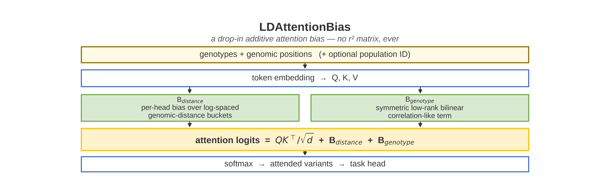
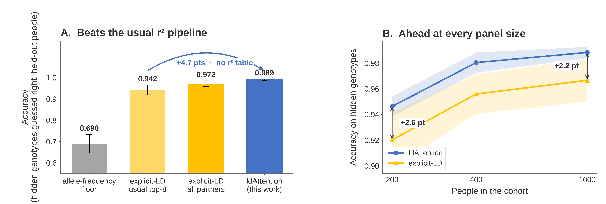
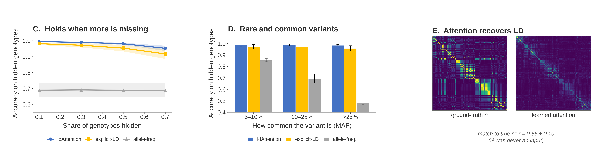
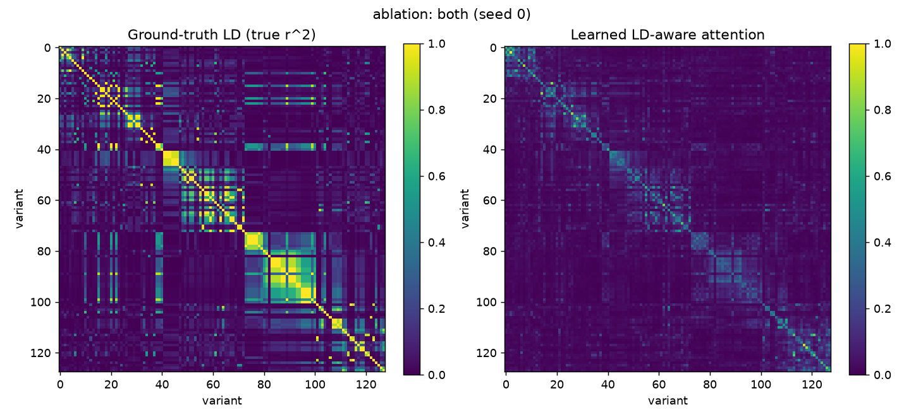

# ldAttention

Reusable **linkage-disequilibrium (LD) aware attention** for genomic transformers.
The model never builds an \(r^2\) table. Instead it adds two learned, symmetric
biases to the attention logits — genomic distance and genotype context — and
lets the transformer recover LD-like structure from data.


```
softmax(QKᵀ / √d + B_distance + B_genotype)
```

<p align="center">
  
</p>

<p align="center"><em>Figure 1. <code>LDAttentionBias</code> is an additive <code>[B, H, L, L]</code> tensor. Drop it into any transformer that accepts an attention mask.</em></p>

---

## Headline result

On the reported sweep — **128 SNPs × 1,000 people**, msprime coalescent,
MAF ≥ 5%, GBS-like **block missingness** (`block_len = 8`), 6 seeds — the
full model reaches **98.9%** held-out imputation accuracy. That is **+4.7
points** over the usual explicit-LD pipeline (top-8 \(r^2\) partners) and
**+1.8 points** over a saturated control that is given every partner and
trained to convergence (paired Wilcoxon \(p = 0.031\), 6/6 seeds).

| Method | Held-out accuracy | vs usual pipeline |
|---|---:|---:|
| **ldAttention (distance + genotype)** | **98.9% ± 0.4** | **+4.7 pts** |
| Plain transformer (no LD bias) | 98.9% ± 0.5 | +4.6 pts |
| Saturated explicit-LD (all partners, 600 epochs) | 97.2% | +3.0 pts |
| Usual explicit-LD (top-8 \(r^2\) partners) | 94.2% ± 2.3 | — |
| Majority genotype | 69.0% ± 4.3 | −25.2 pts |

A **point** is one percentage point of held-out imputation accuracy (exact
0 / 1 / 2 recovery on masked sites of people the model never trained on).
Training is ordinary **cross-entropy**, not a reinforcement-learning reward.

<p align="center">
  
</p>

<p align="center"><em>Figure 2. Panel A: head-to-head on identical masked entries. Panel B: accuracy vs cohort size (200 / 400 / 1,000 people). The layer stays ahead of explicit LD at every size tested; the accuracy ceiling vs a plain transformer is already saturated at 1,000 people.</em></p>

At **200 people** the bias is still load-bearing: **94.6%** vs 92.6% for the
plain transformer (**+2.1 pts**) and ~90.2% for usual explicit LD.

<p align="center">
  
</p>

<p align="center"><em>Figure 3. Missingness sweep, MAF-stratified accuracy, and attention vs the true LD \(r^2\) table (Pearson \(r = 0.56 \pm 0.10\)). Ground-truth \(r^2\) is used for evaluation only — it is never fed to the model.</em></p>

### Three numbers that are easy to mix up

| Quantity | What it is | Reported value |
|---|---|---|
| Genetic \(r^2\) | LD between SNP pairs (left heatmap) | a matrix, not a scalar |
| Pearson \(r\) | correlation of **attention** with that LD table | **0.56 ± 0.10** |
| Dosage \(r^2\) | \((\mathrm{Pearson}\ r)^2\) of predicted vs true 0/1/2 dosage | **0.986 ± 0.005** |

Dosage \(r^2\) is the usual imputation-paper metric. It tracks accuracy here
(0.986 vs 98.9%) and is almost identical for the plain transformer (0.985),
so it is **not** the number that shows the layer’s edge.

---

## Drop-in use

`LDAttentionBias` emits a `[B, H, L, L]` tensor you can add to the attention
logits of any transformer:

```python
import torch.nn.functional as F
from ldattention import LDAttentionBias

ld_bias = LDAttentionBias(hidden_dim=256, num_heads=8)
bias = ld_bias(positions, token_embeddings=x)   # [B, H, L, L]

out = F.scaled_dot_product_attention(q, k, v, attn_mask=bias)
```

```python
from ldattention.integrations import LDAwareMultiheadAttention

layer = LDAwareMultiheadAttention(embed_dim=256, num_heads=8)
out, attn = layer(x, positions)
```

The bias is fully learned, symmetric (like LD), per-head, and GPU-native.

---

## Install

Python 3.10+ (the reported sweep used 3.12). A CUDA GPU is optional but
recommended for the full experiment suite.

```bash
python3.12 -m venv .venv
source .venv/bin/activate
pip install -e .
pip install matplotlib msprime pytest     # figures, coalescent data, tests
```

Quick sanity check:

```bash
python scripts/train_imputation.py --epochs 5
python -m pytest tests/
```

---

## Reproduce the reported results

The poster and the tables above are built from `results_large/` (128 sites ×
1,000 people, block missingness). `results/` is the earlier 64-site × 400-person
archive. `results_small/` is a 100-person 4-arm ablation.

```bash
# 1. reported sweep
python scripts/run_experiments.py --device cuda --use_msprime \
    --block_missing --n_sites 128 --n_haplotypes 2000 --n_seeds 6 \
    --skip_population --skip_budget --out_dir results_large

# 2. saturated explicit-LD control on the same splits and masks
#    (must use the same device — eval masks come from a device generator)
python scripts/strong_baseline_pass.py --results results_large --device cuda

# 3. figures, poster, talk
python scripts/make_poster_figures.py
python scripts/check_poster.py
python scripts/build_poster.py
python scripts/render_poster_pdf.py
python scripts/make_script.py
```

`check_poster.py` refuses to build if a headline number is missing or a figure
slot is empty. Point a rehearsal at another directory with
`LDATTENTION_RESULTS=/path/to/other` without touching the reported sweep.

---

## Results on disk

| Path | Contents |
|---|---|
| [`results_large/`](results_large/) | **Poster source.** `results_summary.csv`, `results_raw.csv`, `results.json`, `strong_baseline.csv`, attention / \(r^2\) heatmaps (`fig_*.png`), arrays (`arr_*.npy`) |
| [`results/`](results/) | Earlier 64 SNP × 400 person archive (10 seeds), plus baseline-strength sweeps |
| [`results_small/`](results_small/) | 100-person 4-arm ablation |
| [`poster/`](poster/) | Print PDF, PowerPoint, talk script, and the figures above |
| [`poster/ECCB2026_ldAttention_poster.pdf`](poster/ECCB2026_ldAttention_poster.pdf) | Print-ready 46 × 36 in poster |
| [`poster/SCRIPT_3MIN.md`](poster/SCRIPT_3MIN.md) | Talk script (glossary-first) |

Summary tables live in CSV so they can be opened without Python:

- [`results_large/results_summary.csv`](results_large/results_summary.csv) — mean ± std per arm
- [`results_large/results_raw.csv`](results_large/results_raw.csv) — one row per (config, seed)
- [`results_large/strong_baseline.csv`](results_large/strong_baseline.csv) — saturated explicit-LD control
- [`results_large/mask_rate_sweep.csv`](results_large/mask_rate_sweep.csv) — accuracy vs missingness

<p align="center">
  
</p>

<p align="center"><em>Figure 4. True pairwise \(r^2\) (left) vs learned attention (right) for the full model on the reported sweep.</em></p>

<p align="center">
  
</p>

<p align="center"><em>Figure 5. Evaluation protocol. The same masked entries are scored for every arm.</em></p>

---

## Project layout

```
ldattention/
  models/ld_bias.py          LDAttentionBias — the reusable primitive
  models/ld_attention.py     LDAwareSelfAttention
  models/encoder.py          encoder stack
  integrations/              adapters for nn.MultiheadAttention / SDPA
  tasks/imputation.py        0 / 1 / 2 genotype head
  data/encoding.py           genotype + sinusoidal position features
  baselines.py               majority + explicit-LD controls
  validation.py              simulation, metrics, attention extraction
  stats.py                   exact paired Wilcoxon signed-rank
scripts/
  run_experiments.py         paper sweep (ablation, scaling, …)
  strong_baseline_pass.py    saturated explicit-LD on saved splits
  make_poster_figures.py     poster/fig_*.png from results_large/
  render_poster_pdf.py       print PDF
tests/                       symmetry / shape / metric invariants
```


## License

Research code for the ECCB 2026 poster. All rights reserved until a license
is added.
