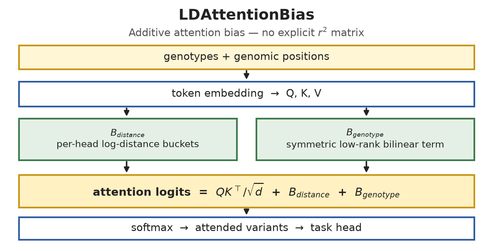
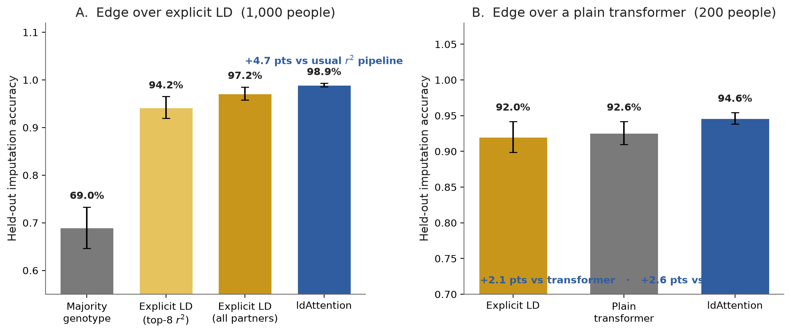
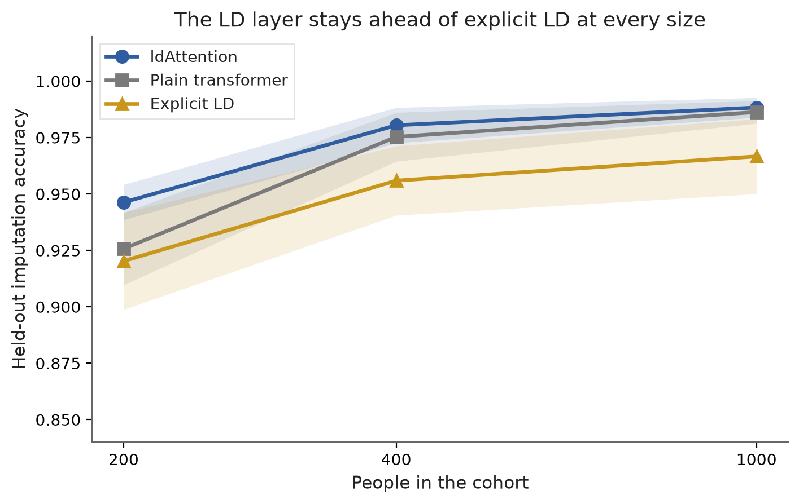
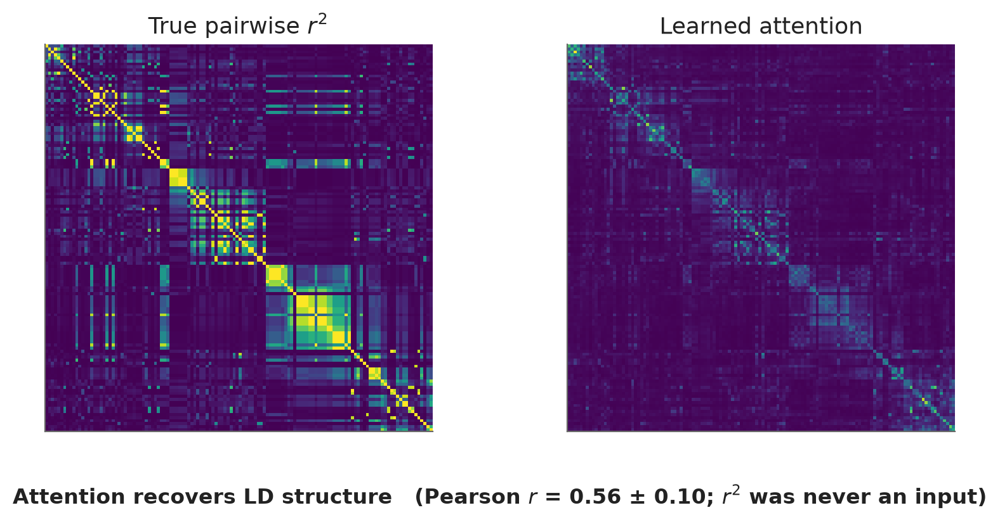
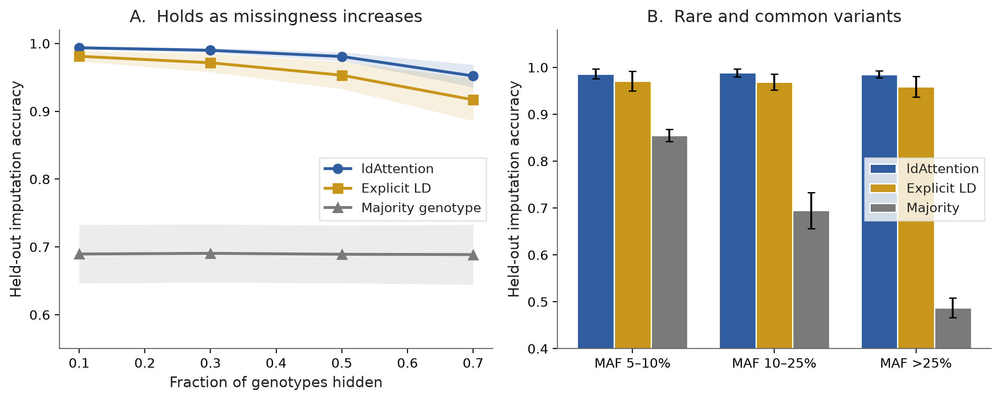

# ldAttention

A reusable **linkage-disequilibrium (LD) bias** for genomic transformers.

Genomic variants are not independent: nearby SNPs travel together on haplotypes.
Standard pipelines capture that with an explicit pairwise \(r^2\) table and a
per-site regression. Standard transformers capture it only if the dataset is
large enough to learn the structure from scratch.

`LDAttentionBias` does neither. It adds two learned, symmetric terms to the
attention logits — genomic distance and genotype context — so any transformer
can use LD without building, storing, or rebuilding an \(r^2\) matrix.

```
softmax(QKᵀ / √d + B_distance + B_genotype)
```

<p align="center">
  
</p>

<p align="center"><em>Figure 1. The layer is an additive <code>[B, H, L, L]</code> tensor. Drop it into any attention implementation that accepts a mask or a position bias.</em></p>

---

## Why the layer matters

| What you usually do | What this layer does |
|---|---|
| Compute a full (or top-\(k\)) \(r^2\) table per cohort | Never materializes \(r^2\) |
| Rebuild the table when the panel or the cohort changes | The same weights transfer; LD is an inductive bias |
| A plain transformer needs a large \(N\) to discover LD | Distance + genotype terms give that structure from the first batch |

The empirical case is genotype imputation (predict the hidden 0 / 1 / 2 at a
SNP). The same bias is task-agnostic: any genomic transformer that attends over
variants can add it.

---

## Results

Reported sweep: **128 SNPs × 1,000 people**, msprime coalescent, MAF ≥ 5%,
GBS-like **block missingness** (`block_len = 8`), 6 seeds. Every number below
is **held-out** accuracy on people the model never trained on, scored on the
**same masked entries** for every method. A point is one percentage point of
that accuracy.

### The layer beats the \(r^2\) pipeline — and a plain transformer when data is scarce

<p align="center">
  
</p>

<p align="center"><em>Figure 2. Left: 1,000 people, vs the usual top-8 \(r^2\) pipeline and a saturated all-partner control. Right: 200 people, where the inductive bias is still load-bearing against a plain transformer.</em></p>

| Method | 1,000 people | vs usual \(r^2\) | 200 people |
|---|---:|---:|---:|
| **ldAttention (distance + genotype)** | **98.9% ± 0.4** | **+4.7 pts** | **94.6% ± 0.8** |
| Saturated explicit-LD (all partners) | 97.2% | +3.0 pts | 92.0% |
| Usual explicit-LD (top-8 \(r^2\) partners) | 94.2% ± 2.3 | — | 90.2% ± 1.4 |
| Majority genotype | 69.0% ± 4.3 | −25.2 pts | 65.8% ± 3.5 |

Paired Wilcoxon signed-rank on the 1,000-person split: **+4.7 pts** vs the usual
pipeline and **+1.8 pts** vs the saturated control (\(p = 0.031\), 6/6 seeds).

At **200 people** the same layer is also **+2.1 pts** over a plain transformer
(94.6% vs 92.6%). That is the sample-efficiency edge: the bias supplies LD
structure the transformer has not yet learned from data.

<p align="center">
  
</p>

<p align="center"><em>Figure 3. ldAttention is ahead of explicit LD at every cohort size tested (200 / 400 / 1,000). The gap to a plain transformer is largest when the cohort is small.</em></p>

### Attention recovers true LD without ever seeing \(r^2\)

<p align="center">
  
</p>

<p align="center"><em>Figure 4. Ground-truth pairwise \(r^2\) (left) vs learned attention (right). Pearson \(r = 0.56 \pm 0.10\) between the two tables. Genetic \(r^2\) is used only for evaluation — it is never an input.</em></p>

### The edge holds under heavier missingness and across allele frequencies

<p align="center">
  
</p>

<p align="center"><em>Figure 5. Left: the same ranking as missingness goes from 10% to 70%. Right: rare and common variants, against the saturated explicit-LD control.</em></p>

### Metrics (do not mix these up)

| Quantity | Meaning | Value |
|---|---|---|
| Held-out accuracy | Exact 0 / 1 / 2 recovery on hidden sites of unseen people | **98.9%** |
| Dosage \(r^2\) | \((\mathrm{Pearson}\ r)^2\) of predicted vs true allele count | **0.986** |
| Pearson \(r\) (attention vs LD) | Correlation of the attention table with genetic \(r^2\) | **0.56 ± 0.10** |

Dosage \(r^2\) is the usual imputation-paper score. Here it tracks accuracy and
is essentially tied with the plain transformer (0.985), so the **layer’s edge is
not a dosage-\(r^2\) story**. Training is ordinary cross-entropy.

---

## Drop-in use

```python
import torch.nn.functional as F
from ldattention import LDAttentionBias

ld_bias = LDAttentionBias(hidden_dim=256, num_heads=8)
bias = ld_bias(positions, token_embeddings=x)   # [B, H, L, L]

out = F.scaled_dot_product_attention(q, k, v, attn_mask=bias)
```

```python
from ldattention.integrations import LDAwareMultiheadAttention

layer = LDAwareMultiheadAttention(embed_dim=256, num_heads=8)
out, attn = layer(x, positions)
```

The bias is fully learned, symmetric (like LD), per-head, and GPU-native.

---

## Install

Python 3.10+ (the reported sweep used 3.12). A CUDA GPU is optional for the
package and recommended for the full experiment suite.

```bash
python3.12 -m venv .venv
source .venv/bin/activate
pip install -e ".[exp,dev]"
python -m pytest tests/
python scripts/train_imputation.py --epochs 5
```

---

## Reproduce the reported results

```bash
python scripts/run_experiments.py --device cuda --use_msprime \
    --block_missing --n_sites 128 --n_haplotypes 2000 --n_seeds 6 \
    --skip_population --skip_budget --out_dir results_large

# Saturated explicit-LD control on the same splits and masks.
# Use the same device as the sweep: eval masks come from a device generator.
python scripts/strong_baseline_pass.py --results results_large --device cuda

python scripts/make_figures.py
```

`results_large/` is the sweep above. `results/` is an earlier 64-site × 400-person
archive (10 seeds). `results_small/` is a 100-person 4-arm ablation.

| File | Contents |
|---|---|
| [`results_large/results_summary.csv`](results_large/results_summary.csv) | mean ± std per arm |
| [`results_large/results_raw.csv`](results_large/results_raw.csv) | one row per (config, seed) |
| [`results_large/strong_baseline.csv`](results_large/strong_baseline.csv) | saturated explicit-LD control |
| [`results_large/mask_rate_sweep.csv`](results_large/mask_rate_sweep.csv) | accuracy vs missingness |
| [`docs/figures/`](docs/figures/) | figures on this page |

---

## Repository layout

```
ldattention/
  models/ld_bias.py          LDAttentionBias — the reusable primitive
  models/ld_attention.py     LDAwareSelfAttention
  models/encoder.py          encoder stack
  integrations/              adapters for nn.MultiheadAttention / SDPA
  tasks/imputation.py        0 / 1 / 2 genotype head
  data/encoding.py           genotype + sinusoidal position features
  baselines.py               majority + explicit-LD controls
  validation.py              simulation, metrics, attention extraction
  stats.py                   exact paired Wilcoxon signed-rank
scripts/
  run_experiments.py         ablation, scaling, missingness
  strong_baseline_pass.py    saturated explicit-LD on saved splits
  make_figures.py            docs/figures/*.png
  train_imputation.py        short smoke train
tests/                       symmetry / shape / metric invariants
docs/figures/                paper figures
results_large/               reported sweep
```

---

## Citation

Manuscript in preparation. For now, cite this repository.

---

## License

Research code. All rights reserved until a license is added.
