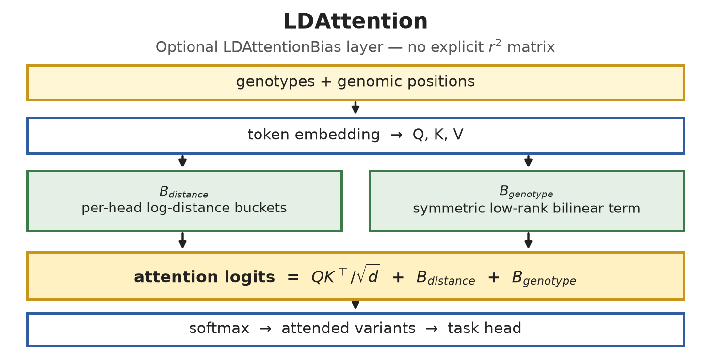
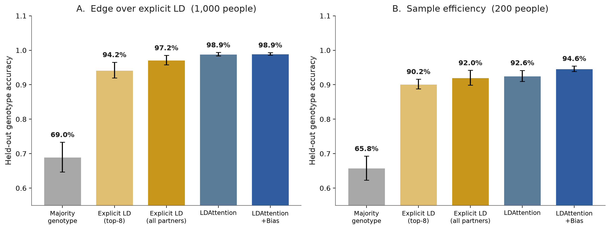
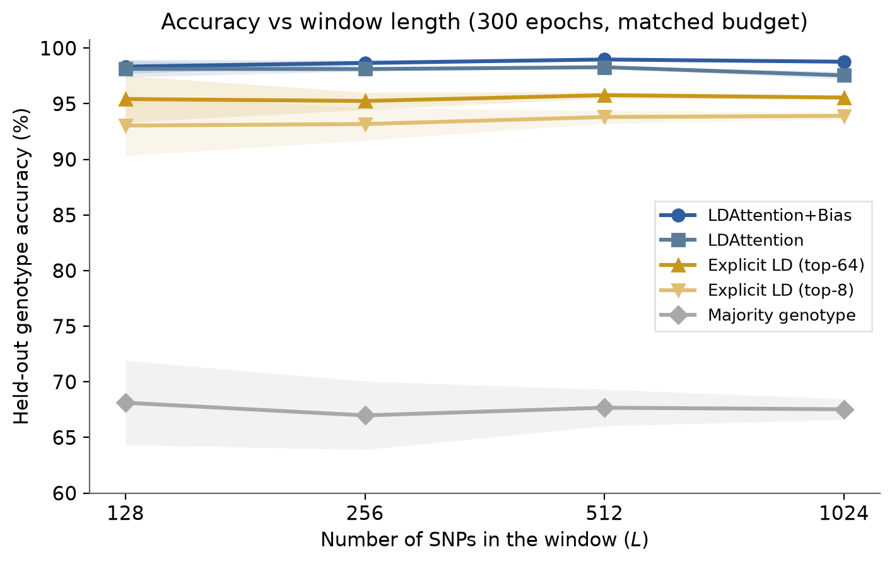
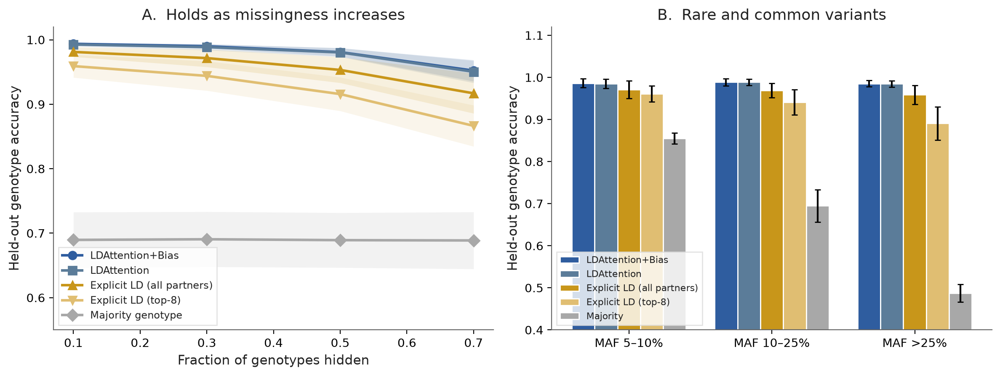

# LDAttention

**Transformers as linkage-disequilibrium (LD) engines** — with an optional
additive bias layer for stronger inductive structure.

Standard genomic pipelines materialize LD as a cohort-specific pairwise \(r^2\)
table. LDAttention instead uses dense self-attention over loci so locus-to-locus
dependence can be learned directly from genotypes. An optional layer,
`LDAttentionBias`, further augments attention logits with learned genomic-distance
and low-rank context terms:

```
softmax(QKᵀ / √d + B_distance + B_genotype)
```

This repository is the companion software and result archive for a forthcoming
manuscript (simulation proof of concept). Genotype recovery under block
missingness is the evaluation *probe*, not a claim of production imputation
performance.

<p align="center">
  
</p>

<p align="center"><em>Figure 1. LDAttention uses standard scaled dot-product attention as a learned LD representation. LDAttentionBias adds distance and genotype-context terms to the logits.</em></p>

---

## Key results (simulations)

Primary protocol: **128 SNPs × 1,000 people**, msprime coalescent, MAF ≥ 5%,
GBS-like **block missingness** (`block_len = 8`), **6 seeds**. Equal-budget
window scaling uses **128–1024 SNPs**, **3 seeds**, **300 epochs**. Every number
is held-out exact genotype accuracy on the **same masked entries** for every method.

<p align="center">
  
</p>

| Method | 1,000 people | 200 people |
|---|---:|---:|
| **LDAttention + Bias** | **98.95% ± 0.37** | **94.6% ± 0.8** |
| LDAttention (no bias) | 98.88% ± 0.48 | 92.6% ± 1.6 |
| Explicit LD (all partners) | 97.15% ± 1.37 | 92.0% ± 2.1 |
| Explicit LD (top-8 \(r^2\)) | 94.23% ± 2.29 | 90.2% ± 1.4 |
| Majority genotype | 68.99% ± 4.33 | 65.8% ± 3.5 |

Under equal training budgets from 128 to 1024 SNPs, LDAttention+Bias stays in a
near-ceiling band (**98.3%–99.0%**) and leads the strongest sparse baseline
(top-64 partners) by about **+2.9 to +3.4** percentage points at every length
(`results_scale/window_equal/`).

<p align="center">
  
</p>

<p align="center">
  
</p>

<p align="center"><em>Figure 4. Missingness sweep (10–70%) now includes LDAttention and LDAttention+Bias; MAF strata on the right.</em></p>

Learned attention correlates with empirical training-set \(r^2\)
(\(r = 0.558 \pm 0.097\) with the bias layer; \(r^2\) is never a model input).

---

## Install

Python 3.10+ (reported sweeps used 3.12). A CUDA GPU is recommended for the
full experiment suite.

```bash
python3.12 -m venv .venv
source .venv/bin/activate
pip install -e ".[exp,dev]"
python -m pytest tests/
python scripts/train_imputation.py --epochs 5
```

### Drop-in use

```python
import torch.nn.functional as F
from ldattention import LDAttentionBias

ld_bias = LDAttentionBias(hidden_dim=256, num_heads=8)
bias = ld_bias(positions, token_embeddings=x)   # [B, H, L, L]
out = F.scaled_dot_product_attention(q, k, v, attn_mask=bias)
```

```python
from ldattention.integrations import LDAwareMultiheadAttention

layer = LDAwareMultiheadAttention(embed_dim=256, num_heads=8)
out, attn = layer(x, positions)
```

---

## Reproduce the reported results

```bash
# Primary 128-SNP sweep (writes results_large/)
python scripts/run_experiments.py --device cuda --use_msprime \
    --block_missing --n_sites 128 --n_haplotypes 2000 --n_seeds 6 \
    --skip_population --skip_budget --out_dir results_large

# Saturated explicit-LD control on the same splits and masks
python scripts/strong_baseline_pass.py --results results_large --device cuda

# Optional: re-score LDAttention (no bias) across mask rates for Figure 4A
python scripts/run_nobias_mask_sweep.py --device cuda --out_dir results_large

# Equal-budget window scaling (128–1024 SNPs)
python scripts/run_scale_experiments.py --experiment window --device cuda

python scripts/make_figures.py
python scripts/make_scale_figures.py
```

| Path | Contents |
|---|---|
| [`results_large/`](results_large/) | Primary 128-SNP tables, mask-rate sweep, strong baseline |
| [`results_scale/window_equal/`](results_scale/window_equal/) | Equal-budget window scaling (reported) |
| [`docs/figures/`](docs/figures/) | Publication figures used in the README |

---

## Repository layout

```
ldattention/                 Python package (bias, encoder, baselines, metrics)
scripts/                     Experiment runners and figure builders
tests/                       Symmetry / shape / metric checks
docs/figures/                README / manuscript figures
results_large/               Primary reported sweep
results_scale/               Window and chromosome-scale experiments
LICENSE                      MIT
CITATION.cff                 Software citation metadata
```

---

## Citation

A manuscript is in preparation / under submission. **Prefer the peer-reviewed
article once it is available.** Until then, cite this software release
(see [`CITATION.cff`](CITATION.cff)):

```bibtex
@software{ldattention2026,
  title        = {LDAttention: transformers as linkage-disequilibrium engines},
  author       = {Abdelwahab, Omar and Torkamaneh, Davoud},
  year         = {2026},
  version      = {0.1.0},
  publisher    = {Zenodo},
  doi          = {10.5281/zenodo.23023658},
  url          = {https://doi.org/10.5281/zenodo.23023658},
  note         = {MIT License. Manuscript forthcoming.}
}
```

Archived release: [](https://doi.org/10.5281/zenodo.23023658)
([concept DOI](https://doi.org/10.5281/zenodo.23023657) resolves to the latest version).

---

## License

[MIT](LICENSE) — free to use, modify, and redistribute with attribution.
This is a reuse-friendly license suitable for accompanying a journal submission;
it does not imply that the manuscript itself is under MIT (manuscript text and
figures for publication remain under the journal / preprint terms).

---

## Status

Proof-of-concept research software. Simulated data only; not a production
genotype-imputation package. External validation on real panels and downstream
tasks beyond the masking probe are planned next steps.
